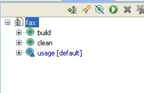
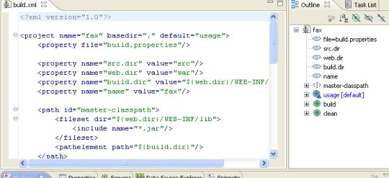

# Eclipse 集成

如果你已经下载并安装了 Eclipse， 你只要再做一点点事情就可以开始了。Eclipse 附带预先绑定的 Ant 插件，随时可以使用。

按照以下简单的步骤，将 Ant 集成到 Eclipse 中。

- 确保 build.xml 文件是你的 Java 项目的一部分，并且该文件的位置在项目内。
- 通过以下步骤，启用 Ant 视图， Window > Show View > Other > Ant > Ant 。
- 打开项目资源管理器中，拖动 build.xml 到 Ant 视图。

你的 Ant 视图类似于：  

点击目标，build/clean/usage 将运行  Ant 以及目标。

点击 “fax” 将执行默认的目标－usage。

Ant 的 Eclipse 插件还附带了一个很好的编辑器，其可用来编辑 build.xml 文件。该编辑器可以识别 build.xml 模式，并可以协助你完成代码。

为了使用 Ant 编辑器，右键单击你的 build.xml（从工程资源管理器中），然后选择用 Ant 编辑器打开。 Ant编辑器看起来应该类似于下图：

